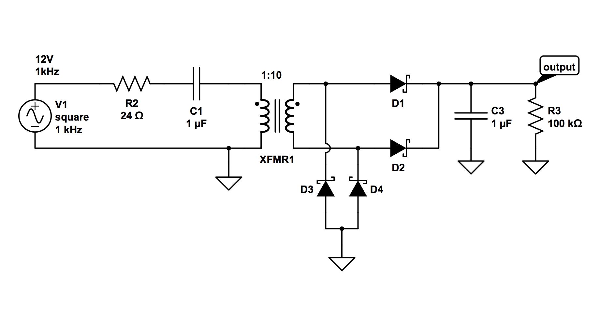
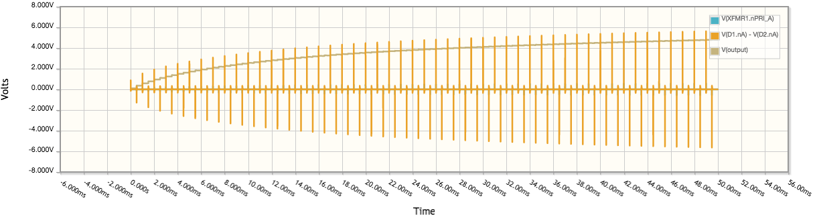
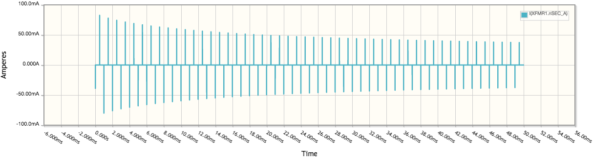
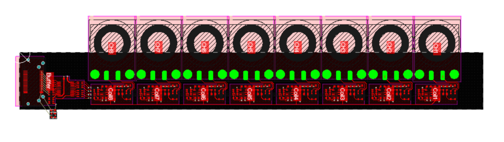
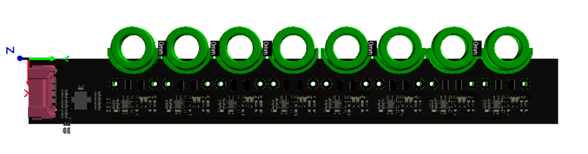

# LINOBYTE

  

## Motivation and Description

As computational devices evolve, more tools and interfaces are built between the user and the machine. This allows us to complete increasingly complex tasks without having to focus so much on understanding the nuances of the machine. While this movement is certainly overall positive, one of the drawbacks is that people no longer learn the fundamental processes and concepts which allow the tool to work. Another negative aspect is that, by neglecting history, we forget the alternatives of the technologies that we use today - forgotten alternatives that maybe once were the status quo. Understanding of those alternatives would give us a broader view of the pros and cons of what we have today, how they superseded their ancestors and what are their pitfalls - important knowledge for those who design possible futures.

Its with these preocupations in mind that Linobyte came into existence. It conciliates the explanation of how bits, bytes and [chars](https://en.wikipedia.org/wiki/Character_(computing)) work, with a hands on experience of creating [Core Rope ROMs](https://en.wikipedia.org/wiki/Core_rope_memory): read-only memories that were written by weaving an enameled copper wire through ferrite cores. 

The whole process is quite straightforward, and the result is immediate: the user can write up to 8 characters - a word, in the Linobyte system. Each character consists of one eight-bit byte. Each core represents one bit, and by weaving the conductive wire through the core center, the user sets a bit as positive. By skipping the core, its set as zero. By connecting the wire to the final position, the byte is written. So, if the user wants to write the "A" character, she/he checks the table, to see that "A" is 65 in decimal, 41 in HEX, and 01000001 in binary. Thus, the first (least significant bit) and seventh bit have to be set. She/he then proceeds to the next char, and so forth. After each char is set, it appears on a display, so the user can check whether the bits were correctly set and proceed or correct if necessary.

(So, in essence, 1 word = 8 chars = 8 bytes = 8 * 8 bits)

ASCII table:

Core memory experiment from http://www.timui.org/2015/

## Important dates:

- finish the "Char" PCB design (3rd week of April)
- Sending the Char Gerber files to the manufacturer (4th week of April)
- Finishing the "Word" (Main board) PCB design (4th week of April)
- Send the "Word" Gerber files to the manufacturer (4th week of April)
- Finish the Bill of Materials and order the components from Mouser (End of April)
- Assemble the char boards (1st of May)
- Assembble the word boards (2nd of May)
- Write the firmware and test the boards. (3rd week of May)
- Test the boards as HID Keyboard (3rd week of May)
- Decide if I want to build an external custom display (e-ink, 16 segments, 5x7 array, etc)

## Preliminary Functional Block Diagram

#### Description of the main components:

##### Char

- Coil: a 1:10 to 1:30 transformer (the single turn will be the wire than can be weaved or not)
- Rectifier: Full bridge of schottky rectifiers: wire can be weaved from any direction
- Comparator: Since I don't know for sure how efficient the coil transformer will be, I want to be able to set the threshold manually.
- Coil Driver: Sends pulses through the coils. A pulse rated capacitor (probabbly Wima MKT) will be used in series to prevent coil saturation. Square wave signal will come from main board (either a VCO, astable multivibrator or a PWM signal from the MCU).
- Buffer with tri-state outputs: Outputs will be active or high-impedance depending on Enable pin. So I can read all chars using the same pins on the MCU.

##### Word

- VCO/Astable Multivibrator: generate a reference frequency for the coil drives. Configurable via a trimpot. Fallback will be a PWM generated by the MCU.
- 3 to 8 Decoder: with three pins on the MCU I can enable one of the 8 chars at a time, so only one of them is driving the 8 inputs on the MCU.
- Microcontroller: will read the chars and print them out.

##### Display

I personally really wanted to experiment with e-ink displays (Should be doable by adding an SPI header on the main board), but 16 segment displays or 5x7 matrixes might be more thematically suited - and are quite easy to use. Another option would be having the whole system just act as a keyboard: plug it into a computer and type the text that is in the coils (Raspberry pi + a small display for example).

##### Power supplies (not drawn)

Microcontrollers and ICs in general will use 3.3V. I might want to power the coil drivers with 5V, 12V or 24V depending on how efficient the transformers are. I plan to power the whole thing via a USB port and have the appropriate buck and boost converters on the board. I will avoid LDOs because due to the clamp diodes to 3.3V or 5V on the rectifiers, the regulator will probably need to sink some current.

## Simulations

## PCBs

As of 10/April.  

2D view:  

  

3d view:  

## Minor To dos

1. Sketch weave "needle" and connection, can't use magnets cause ferrites are magnetic, minor annoyance when weaving..
2. Footprint for magnetic latch switch (magnet, 3xpogo, magnet: pcb switches and 3way and gate?), and/or find out how to attack magnets to PCBs.
3. Switch for external coils
4. Decide how to drive the coils (VCO + LSD?)
5. Add simulations to readme

Teaching how bits form bytes and then characters with a hands on approach.

An homage and revival of core rope memories.

Instead of pressing a button to make a letter or touching a screen, you weave a wire. Handwritting, etc

Pulse generator/ Capacitor in series? / Primary / secondary / full bridge / capacitor / resistor/zener regulator schmitt trigger? / I2C 

## Refs

aulis.com/pascal.htm

http://drhart.ucoz.com/index/core_memory/0-123

http://www.ciphersbyritter.com/MARK8/MAGCORE/MAGCORE.HTM

http://qrp.gr/coreROM/

ROD ROM
http://www.computerculture.org/2012/10/jacquard-looms-and-rod-roms/

Neil on how transformers work.
https://electronics.stackexchange.com/a/221279/61257

### Comparators:

Maxim App note 3616, Adding extra histeresis to comparators  
https://www.maximintegrated.com/en/app-notes/index.mvp/id/3616

Texas Instruments: Comparator with histeresis reference design  
http://www.ti.com/lit/ug/tidu020a/tidu020a.pdf

## BOM

Potential coils: 9mm x 16mm x 5mm (inner, outer, thickness)  
https://www2.mouser.com/Passive-Components/Ferrites/Ferrite-Toroids-Ferrite-Rings/_/N-fb8t7Z1yzvvqx?P=1ya7hnoZ1z0vsmwZ1z0vsssZ1z0vsa5Z1z0vsltZ1z0vrn7&Rl=fb8t7ZerbuZ1yxgwg4Z1yzmqroSGT&Ns=Inside%20Diameter|1

AP331  
Single Differential Comparator  
https://www2.mouser.com/ProductDetail/Diodes-Incorporated/AP331AWG-7?qs=sGAEpiMZZMuayl%2fEk2kXcbfp56RBiQa%252bBYTJGtoHiWw%3d

Kemet ESD - R Series

Schmitt Trigger Octal Non Inverting  
https://www.mouser.at/ProductDetail/Nexperia/74HC7541PW118?qs=sGAEpiMZZMtOwpHsRTkso4N4DgL6o1r6unaSV%252bVDkdI%3d

3 to 8 decoder  
74HC138  
https://www.mouser.at/datasheet/2/302/74HC_HCT138-1148685.pdf

Card edge 20 Pos connector  
https://www.digikey.com/product-detail/en/te-connectivity-amp-connectors/5-5530843-0/A31722-ND/770548

e-ink  
296x128 2.9in  
https://www.amazon.de/Waveshare-Resolution-Electronic-Controller-interface/dp/B071LGVVL1/ref=sr_1_1?rps=1&ie=UTF8&qid=1523130359&sr=8-1&keywords=e+paper+arduino&refinements=p_76%3A419122031